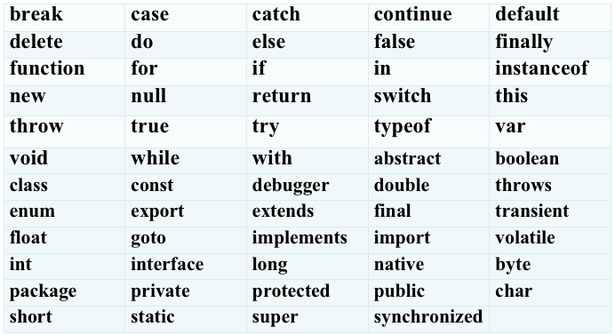

# JavaScript基础，主讲：汤小洋

## 一、JavaScript简介

### 1. 什么是JavaScript

​	JavaScript简称为JS，由网景公司开发的客户端脚本语言，不需要编译，可以直接运行

​	Web前端三层：

- 结构层  HTML  定义页面的结构
- 样式层  CSS    定义页面的样式
- 行为层  JavaScript  用来实现交互，提升用户体验

### 2. JavaScript作用

+ 在客户端动态的操作页面
+ 在客户端做数据的校验
+ 在客户端发送异步请求

## 二、JavaScript基本用法

### 1. 基本结构

~~~ html
<head>
	<meta charset="UTF-8">
	<title>Document</title>
	<script type="text/javascript">
		alert("Hello World !");
		console.log("Hello World !");
		document.write("Hello World !");
	</script>
</head>
~~~

​	输出信息的三种方式：

- `alert()` 弹出警告框
- `console.log()`输出到浏览器的控制台
- `document.write()` 输出到页面

### 2. 转义符

​	由于字符串中经常会有一些特殊字符，比如换行、引号等，为了让字符能够正常显示，此时需要使用转义符

​	常用转义符：

- `\n` 换行
- `\t` 缩进
- `\"`双引号
- `\'`单引号

### 3. 注释

​	两种：

- 单行注释

    以 `//`开始，以行末结束

- 多行注释

    多行注释以` /* `开始，以` */` 结束

### 4. 语法约定

​	编码规范：

- 区分大小写
- 代码缩进
- 建议每行只写一条语句，语句结束以分号结尾
- 如果不以分号结尾，则以行末作为语句的结束
- 代码执行顺序：从上往下，从左往右

### 5. 引用方式

​	引用JavaScript有三种方式：

1. 内联方式

    在页面中使用script标签，在script标签的标签体中编写js代码

    script标签可以放在页面的任意位置，一般放在head中

    ```html
    <script type="text/javascript">
    	js代码 
    </script>
    ```

2. 行内方式

    在普通标签中编写js代码，一般需要结合事件属性，如onclick、onmouseover等

    ```html
    <input type="button" value="点我" onclick="alert('Hello')"/>
    <!-- 使用超链接的href属性执行js时，必须添加javascript前缀 -->
    <a href="javascript:alert('World')">我是超链接</a>
    ```
    
3. 外部方式

    使用单独的`.js`文件定义，然后在页面中使用script标签引入外部脚本文件

    ```html
    <script type="text/javascript" src="js文件的路径"></script>
    ```
    
    ​	注：如果某个script标签用于引入外部js文件，则该script标签的标签体中不能再写js代码

## 三、变量和数据类型

### 1. 变量

#### 1.1 简介

​	在程序运行过程中其值可以改变的量，是一个数据存储空间的表示，即给内存空间起别名

​	将数值通过变量进行存储，以便程序随时使用，通俗点来说，变量就是用来存储数据的

​	JavaScript是弱变量类型的语言，声明变量只需要使用`var`关键字

​	语法：`var 变量名=变量值;`

#### 1.2 命名规则

​	规则：

- 只能由数字，英文字母，下划线以及$符号组成，但不能以数字开头
- 不能使用javascript中的关键字
- 区分大小写
- 通常第一个单词首字母小写，其他单词首字母大写




​	命名规范：

- 驼峰命名法

    第一个单词首字母小写，其他单词首字母大写，如变量名、方法名、函数名等

- 帕斯卡命名法

    所有单词首字母大写，如类型名称、构造函数名称等

#### 1.3 加号的作用

​	作用：

- 两个字符串用加号连接：`连接这两个字符串`
- 两个数值用加号连接：`进行加法运算`
- 字符串和其他值用加号连接：`连接`

#### 1.4 字面量

​	字面量（直接量）表示如何表达这个值，一般除去表达式外，给变量赋值时等号右边都可以认为是字面量。

​	简单来说就是字面上就能明白代码含义。

​	分类：

- 字符串字面量(string literal )，如var name=“tom”;
- 数组字面量(array literal)，如var array=[12,32];
- 对象字面量(object literal)，如var stu={name:”tom”,age:20}
- 函数字面量(function literal)

### 2. 数据类型

#### 2.1 简介

​	变量中存储的是什么样的数据，那么这个变量就是什么样类型。

​	数据类型：

- string 存储一串字符,用双引号或单引号括起来
- number 表示整数或浮点数
- boolean 表示真假, true或false
- undefined 变量被声明了，但未被赋值
- null 空

#### 2.2 判断数据类型

​	使用typeof判断数据类型

​	用法：`typeof(变量)` 或 `typeof  变量`

​	返回值：string、number、boolean、undefined、object

#### 2.3 获取用户输入

​	使用prompt()提示用户输入数据

​	语法：`prompt(“提示信息”, “输入框的默认信息”);`

## 四、运算符

### 1. 算术运算符

#### 1.1 用法

| 运算符 | 含义            |
| ------ | --------------- |
| +      | 加              |
| -      | 减              |
| *      | 乘              |
| /      | 除              |
| %      | 取余，求模      |
| **     | 次方            |
| ++     | 自增，对原值加1 |
| --     | 自减，对原值减1 |

前缀自增自减和后缀自增自减的区别：

- 前缀自增自减

    先进行自增或自减运算，然后再执行表达式

- 后缀自增自减

    先执行表达式，然后再进行自增或自减运算

#### 1.2 NaN

​	含义：Not a Number 表示非数字，其自身是number类型

​	作用：用来表示数值的一种不正常的状态，一般在计算出错时会出现

​	使用`isNaN()`检查参数是否为非数字

- 如果是非数字，则返回true
- 如果不是非数字（即是数字），则返回false

#### 1.3 Math对象

​	执行常见的算数任务，用法：`Math.方法名(参数)`

​	常用方法：

~~~ javascript
Math.abs(a);		// 得到a的绝对值
Math.pow(a,b);	// 得到a的b次方
Math.round(a);	// 四舍五入
Math.ceil(a);		// 向上取整
Math.floor(a);	// 向下取整
Math.random();	// 产生随机数，范围[0.0,1.0)
Math.max(a,b…);	// 返回最大值
Math.min(a,b…);	// 返回最小值
Math.PI;				// 返回圆周率π的值，不能加小括号
~~~

### 2. 关系运算符

​	也称为比较运算符，用来做比较运算，比较的结果是boolean类型

| 运算符 | 含义                                                         |
| ------ | ------------------------------------------------------------ |
| >      | 大于                                                         |
| <      | 小于                                                         |
| >=     | 大于等于                                                     |
| <=     | 小于等于                                                     |
| ==     | 等于：只判断数据的内容，不判断数据的类型                     |
| ===    | 全等于：既判断内容，也判断类型                               |
| !=     | 不等于：只判断数据的内容，如果内容一样，则返回false          |
| !==    | 不全等：如果内容或类型两者中有一个不一样，则返回true，否则返回false |

### 3. 赋值运算符

| 运算符 | 含义     |
| ------ | -------- |
| =      | 简单赋值 |
| +=     | 加法赋值 |
| -=     | 减法赋值 |
| *=     | 乘法赋值 |
| /=     | 除法赋值 |
| %=     | 求模赋值 |

### 4. 逻辑运算符

| 运算符 | 含义         |
| ------ | ------------ |
| &&     | 逻辑与，并且 |
| \|\|   | 逻辑或，或者 |
| !      | 逻辑非，取反 |

​	逻辑中断，也称为短路运算：

- ||   如果第一个为真就返回第一个表达式，否则返回第二个表达式
- &&   如果第一个为假就返回第一个表达式，否则返回第二个表达式

### 5. 条件运算符

​	也称为三目运算符，语法：`条件 ? 表达式1 : 表达式2`

​	当条件为true时执行表达式1，当条件为false时执行表达式2

### 6. 运算符优先级

​	从高到低的顺序：

1. 小括号( )
2. 一元运算：自增++、自减--、非!
3. 乘*、除/、取余%
4. 加+、减-
5. 关系运算：>、<、>=、<=
6. 相等运算： ==、!=
7. 逻辑与&&
8. 逻辑或||
9. 赋值运算：=、+=等

​    注：当运算符较多时，建议使用`()小括号`控制运算的顺序

## 五、数据类型转换

### 1. 强制类型转换

​	也称为显式转换

#### 1.1 转换为number

​	三种方式：

1. 使用Number()

    如果内容可以转换成数字，则返回对应的数字（整数或小数）

    如果内容不可以转换成数字，则返回NaN

    如果内容为空字符串或null，则返回0

    如果内容为boolean，则true返回1，false返回0（boolean值在内存中就是以数字来存储，true为1，false为0）

2. 使用parseInt()

    将内容转换成整数（直接去掉小数）

    会从第一个字符开始解析，直到遇到非数字符号停止，并返回已解析的部分数值

3. 使用parseFloat()

    将内容转换成小数

#### 1.2 转换为string

​	三种方式：

1. 拼接空字符串

    `""`+要转换的内容

2. 使用String()

    将要转换的内容放在String后的小括号中

3. 使用toString()

    直接调用变量的toString()方法

#### 1.3 转换为boolean

​	两种方式：

1. 使用Boolean()

    false、0、空字符串、Undefined、null、NaN会被转换成false

    其它的都会被转成true

2. 使用`!!`转换

### 2. 自动类型转换

​	也称为隐式转换

​	自动转换为number的两种方式：

1. 在参与`-、*、/、%`等运算时会自动转换为number
2. 直接在要转换的内容前添加`+`

## 六、选择结构

### 1. 简介

​	程序结构有三种：顺序结构、选择结构、循环结构

​	根据条件进行判断，从而执行不同的操作，称为选择结构（分支结构），其实就是条件判断

​	选择结构的类型：if、switch

### 2. 基本用法

#### 2.1 if

​	分为：单分支结构、二分支结构、多分支结构、嵌套if结构

​	语法：

```java
if(条件1){
	代码块1 
}else if(条件2){
    代码块2
}else if(条件3){
    代码块3
}
...
else{
 	代码块n   
}
```

#### 2.2 switch	

​	用来进行等值判断

​	语法：

```java
switch (表达式) {  // 表达式为要判断的内容
    case 常量1:
        代码块1
        break;
    case 常量 2:
        代码块2
        break;
    …

   	default:  // 当所有常量都无法匹配时会执行default语句
        语句;
}
```

### 3. 两者的区别


- switch结构

    只能进行等值的判断

- if结构

    没有限制，适合某个连续区间的判断

## 七、循环结构

### 1. 简介

​	重复性的执行某个操作，就是循环，称为循环结构

​	循环结构的类型：while、do...while、for、for...in、for...of

### 2. 基本用法

#### 2.1 while

​	语法：

```java
while(条件){
	代码块
}
```

​	特点：先判断，再执行，只要条件成立就不停的执行

#### 2.2 do...while

​	语法：

```java
do{
    代码块
}while(条件);
```

​	特点：先执行，再判断，循环操作至少会执行一次

#### 2.3 for

​	语法：

```java
for(初始化;条件;迭代){
    代码块
}
```

#### 2.4 for...in

​	对集合数据进行迭代遍历

​	语法：

~~~ javascript
for(循环变量 in 集合){
  循环操作
}
~~~

​	循环变量是遍历到的数据在集合中的索引顺序（从0开始），而非数据本身

​	可以通过`集合[循环变量]`的形式获取数据

#### 2.5 for...of

​	对集合数据进行迭代遍历

​	语法：

~~~ javascript
for(循环变量 of 集合){
  循环操作
}
~~~

​	循环变量就是遍历到的数据本身

#### 2.6 总结

​	循环次数确定时一般使用for

​	循环次数不确定时一般使用while和do...while

​	对集合进行遍历时使用for...in和for...of

### 3. 循环控制

​	break：跳出整个循环，执行循环之后的代码，一般与if一起使用

​	continue：跳出本次循环，执行下一次循环（本次尚未执行完的代码不再执行）

### 4. 二重循环

​	一个循环中嵌套着另一个循环，称为二重循环，各种循环可以相互嵌套

- 外层循环变量变化一次，内层循环变量要变化一遍
- 二重循环中的break和continue，遵循就近原则

## 八、数组

### 1. 简介

​	数组就是用来存储一组数据的

- 声明一个变量就是在内存空间划出一块合适的空间
- 声明一个数组就是在内存空间划出一串连续的空间

​    数组的三要素：

- 数组名称：用于区分不同的数组
- 数组元素：向数组中存放的数据
- 元素下标：数组元素的编号，也称为索引，从0开始，通过下标来访问数组元素

### 2. 基本用法

​	步骤：

1. 创建数组

    var 数组名=new Array();

2. 为数组元素赋值

    数组名[索引]=元素值;

3. 获取元素值

    数组名[索引]

### 3. 定义数组的方式

​	两种方式：

- 使用`new Array()`

~~~ javascript
var array=new Array();	// 创建一个空数组，长度为0
var array=new Array(4);	// 创建一个长度为4的数组（只填一个数字）
var array=new Array("apple", "orange", "peach", "bananer");　// 创建一个包含初始元素的数组
~~~

- 使用数组字面量`[]`

~~~ javascript
var names=[ ]; // 创建一个空数组
var names= ["apple", "orange", "peach", "bananer"]; // 创建一个包含初始元素的数组
~~~

### 4. 字符串索引数组

​	默认情况下，会使用数字作为数组索引，也可以使用字符串作为数组索引，称为字符串索引数组

- 字符串索引一般称为key键，对应的元素称为value值
- key不会对length属性产生影响，所以不适合使用普通for循环，而应该使用for…in或for...of循环

### 5. 数组常用方法

| 方法名        | 含义                                                         |
| ------------- | ------------------------------------------------------------ |
| reverse()     | 将数组元素倒序排列                                           |
| indexOf()     | 返回指定元素在数组中第一次出现的位置                         |
| lastIndexOf() | 返回指定元素在数组中最后一次出现的位置                       |
| join()        | 将数组拼接为string                                           |
| concat()      | 将多个数组拼接成一个数组                                     |
| push()        | 向数组末尾添加一个或多个元素，并返回新的长度                 |
| pop()         | 删除并返回数组的最后一个元素                                 |
| unshift()     | 向数组开头添加一个或多个元素，并返回新的长度                 |
| shift()       | 删除并返回数组的第一个元素                                   |
| slice()       | 返回数组中指定范围内的元素                                   |
| splice()      | 删除元素，并在删除位置添加新的元素，然后返回被删除的元素     |
| toString()    | 将数组转换为字符串                                           |
| valueOf()     | 返回数组对象本身，一般会自动调用                             |
| sort()        | 排序，默认按字符编码的顺序排列，非string类型会自动转换为string，也可以自定义比较规则 |
| forEach()     | 遍历数组中的每个元素                                         |

### 6. 二维数组

​	二维数组可以认为是特殊的一维数组：

- 一维数组中的每个元素又是一个一维数组
- 即数组中的元素也是数组

### 7. 冒泡排序

​	冒泡排序是一种比较简单的排序算法

- 比较相邻的元素，如果第一个比第二个大，交换它们两个（升序）
- 比较相邻的元素，如果第一个比第二个小，交换它们两个（降序）
- 针对所有元素重复以上的步骤，直到没有任何一对数字需要比较

​	结论：

- 如果有n个元素，则需要比较n-1轮
- 每一轮比较n-m次，m表示第几轮

## 九、函数

### 1. 简介

​	函数是用来完成特定功能的代码块，可以被调用执行多次，实现复用

​	分类：

- 内置函数
- 自定义函数

### 2. 内置函数

| 函数名       | 含义                                                         |
| ------------ | ------------------------------------------------------------ |
| typeof()     | 判断变量的类型                                               |
| isNaN()      | 判断参数是否为NaN                                            |
| parseInt()   | 将数据转换为整数                                             |
| parseFloat() | 将数据转换为小数                                             |
| eval()       | 计算字符串表达式的值，并执行其中的JavaScript代码             |
| encodeURI()  | 使用`ISO8859-1`对字符串进行编码，每个UTF-8的汉字编码成3个16进制字节，如下： `%字节1%字节2%字节3` |
| decodeURI()  | 使用`ISO8859-1`对字符串进行解码                              |
| escape()     | 使用`Unicode`对字符串进行编码，每个UTF-8的汉字被编码成一个双字节16进制转义字符`%uXXXX`，中文范围%u4e00---%u9fa5 |
| unescape()   | 使用`Unicode`对字符串进行解码                                |

### 3. 自定义函数

​	语法：

~~~ javascript
// 1.定义函数
function 函数名(参数1,参数2...){　// 形参
  // 函数体
}

// 2.调用函数
函数名(参数1,参数2...); // 实参
~~~

​	函数的参数：

+ 定义函数时指定的参数，称为`形参`，没有实际的值，占位置
+ 调用函数时指定的参数，称为`实参`，有实际的值
+ 实参个数和形参个数可以不同，未指定参数时其默认值为undefined

​    函数的返回值：

+ 函数执行后可以返回一个结果，称为函数的返回值
+ 使用`return`关键字来返回函数执行后的结果值
+ 如果函数中没有使用return返回值，则默认返回undefined

### 4. 变量作用域

​	  变量的作用域：

- 局部作用域

    在函数中声明的变量，只能在该函数内访问，函数运行结束后变量自动销毁

- 全局作用域

    在函数外声明的变量，或者在函数内未定义而直接赋值的变量，在任何位置都可以访问，将所在页面关闭后销毁

- 块级作用域

    使用`let`关键字声明的变量，只能在声明它的代码块内访问（使用`var`声明的变量没有块级作用域的概念）

​    注意：

- 如果局部变量和全局变量同名，默认访问的是局部变量
- 如果想访问全局变量，必须使用`window`前缀，在一定条件下也可以使用`this`前缀

### 5. 变量提升

​	解析器执行JavaScript代码的过程：

1. 首先预解析（全局作用域）

    将变量var和函数function的声明提前到作用域的最上面，需要注意的是变量的赋值操作不会提前

2. 然后执从上往下，一行一行执行代码

3. 当执行函数时会进入函数内部，再次预解析 （局部作用域）

4. 然后从上往下，一行一行执行代码

### 6. 定义函数的方式

​	两种方式：

- 函数声明

  ~~~ javascript
  function 函数名(参数){ 
  		函数体
  }
  ~~~

- 函数表达式

  ~~~ javascript
  var 变量名 = function(参数) // 等号右边的函数没有名字，称为匿名函数
  { 
  		函数体
};
  
  调用函数：变量名(参数);
  ~~~

​    两种方式的区别：

- 函数声明在编写时可以先调用，再声明
- 函数表达式必须先定义，再调用

### 7. 回调函数

​	不立即执行的函数调用，满足一定条件时才会执行或者由别的代码调用执行，称为回调函数 `callback`

​	调用时只写函数名，不能写小括号()和参数

​	应用：

- 作为事件绑定的函数，即当事件触发时要执行的函数
- 作为另一个函数的参数，即将函数作为参数传给另一个函数（函数也是一种数据类型）

### 8. 匿名函数

​	没有名字的函数，称为匿名函数，一般用于回调	

​	应用场景：

- 用于事件的回调

    ```js
    window.onclick=function(){ // 匿名函数，用于回调
    	console.log("点击了页面！");
    };
    ```

- 用于一次性执行的函数，会自动执行，称为自执行函数

    ```js
    (function(){
    	console.log("此函数只执行一次！");
    })();
    ```

- 将匿名函数作为另一个函数的参数

## 十、Debug调试

### 1. 简介

​	程序的故障和缺陷，称为bug

​	排除程序的故障和缺陷，称为debug

​	debug代码调试的方式：

- alert()
- console.log()
- 打断点，使用开发人员工具

### 2. 步骤

​	步骤：

1. 设置断点（暂停执行的代码行 ）
2. 单步运行
3. 观察变量