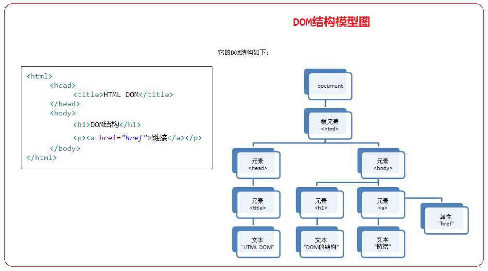
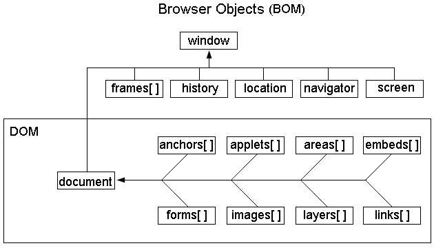
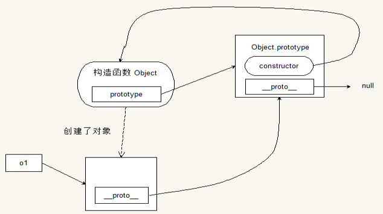

# JavaScript进阶，主讲：汤小洋

## 一、DOM

### 1. DOM简介

​	Document Object Model 文档对象模型

​	浏览器加载HTML文档时，会将HTML文档解析为一个树形结构，称为DOM树

- HTML文档和DOM树是一一对应的关系
- 当DOM树被改变时，与之对应的HTML文档也会随之改变
- 当需要对HTML中的内容进行动态改变时，可以使用DOM来进行操作
- DOM提供了一组用来操作HTML文档的API，即提供一套属性、方法和事件 
- 树上的每一个节点都是一个DOM对象，树的顶层为`document`对象，表示整个文档



### 2. 查询操作

​	获取DOM对象

| 方法                                     | 含义                                        |
| :--------------------------------------- | :------------------------------------------ |
| document.getElementById("id值")          | 根据id属性来查询节点，返回匹配的第一个节点  |
| document.getElementsByName("name属性值") | 根据name属性来查询，返回所有匹配的节点集合  |
| document.getElementsByTagName("标签名")  | 根据标签名来查询，返回所有匹配的节点集合    |
| document.getElementsByClassName("类名")  | 根据class属性来查询，返回所有匹配的节点集合 |
| document.querySelector("选择器")         | 根据css选择器来查询，返回匹配的第一个节点   |
| document.querySelectorAll("选择器")      | 根据css选择器来查询，返回所有匹配的节点集合 |
| node.getElementsByTagName("标签名")      | 在当前节点的内部根据标签名来查询            |
| node.parentNode属性                      | 查询当前节点的父节点                        |
| node.children属性                        | 查询当前节点的所有子元素节点                |
| node.firstElementChild属性               | 查询当前节点的第一个子元素节点              |
| node.lastElementChild属性                | 查询当前节点的最后一个子元素节点            |
| node.previousElementSibling属性          | 查询当前节点的上一个元素节点                |
| node.nextElementSibling属性              | 查询当前节点的下一个元素节点                |

节点类型分为：元素节点、文本节点、属性节点等

### 3. 访问操作

#### 3.1 访问属性

​	获取/设置DOM对象的属性

​	DOM对象的属性和HTML标签的属性几乎是一样的，一般情况下DOM对象都会存在一个与对应HTML标签同名的属性

​	两种方式：

- 直接访问属性

    用法：`DOM对象.属性`　

- 调用setAttribute()和getAttribute()方法

    用法：`DOM对象.setAttribute("属性名","属性值") ` 或 `DOM对象.getAttribute("属性名")`

#### 3.2 访问内容

​	获取/设置标签中的内容

​	三种方式：

- 使用innerHTML

    用法：`DOM对象.innerHTML`  将内容解析为HTML

- 使用innerText

    用法： `DOM对象.innerText`  将内容作为纯文本，出现转义符时会进行解析

- 使用textContent

    用法： `DOM对象.textContent`  将内容作为纯文本，出现转义符时会直接保留特性

#### 3.3 访问CSS

​	获取/设置CSS样式

​	三种方式：

- 使用style属性

    用法：`DOM对象.style.样式属性`

    如果CSS属性中有短横线-，需要去掉短横线，然后将其后的单词首字母改成大写，如`fontSize`

- 使用className属性

    用法：`DOM对象.className`

- 使用classList属性

    用法：`DOM对象.classList`

    通过classList的`add()`、`remove()`进行类样式的添加和删除

### 4. 更新操作

​	节点的创建、添加、修改、删除等

| 方法                                | 含义                                                     |
| :---------------------------------- | :------------------------------------------------------- |
| document.createElement("标签名")    | 创建一个元素节点，即标签                                 |
| document.createTextNode("文本内容") | 创建一个文本节点，即标签中的文本内容                     |
| node.appendChild(newNode)           | 将一个新的节点newNode添加到指定的节点node中子节点的末尾  |
| node.insertBefore(newNode,refNode)  | 将一个新的节点newNode插入到node节点的子节点refNode之前   |
| node.replaceChild(newNode,refNode)  | 用一个新的节点newNode替换原有的node节点中的子节点refNode |
| node.removeChild(refNode)           | 删除当前节点中指定的子节点                               |
| node.remove()                       | 删除当前节点                                             |

## 二、事件处理

### 1. 简介

​	事件：发生在HTML元素上的事情，可以是用户的行为，也可以是浏览器的行为，如

- 用户点击了某个HTML元素
- 用户将鼠标移动到某个HTML元素上
- 用户输入数据时光标离开
- 页面加载完成

​    事件源：事件触发的源头，即触发事件的元素，如按钮、输入框、超链接等

​    事件对象：当一个事件发生时，这个事件相关的详细信息会被保存到一个对象中，称为`event`对象

​    事件监听：监听事件的发生，绑定事件函数，当事件被触发后执行该事件函数，即回调函数

### 2. 绑定事件

​	三种方式：

+ 静态绑定，通过为标签的`事件属性`赋值

    ```html
    <input type="button" value="按钮" onclick="fn()">
    ```

+ 动态绑定，通过为DOM对象的`事件属性`赋值

    ```html
    <input type="button" value="按钮" id="btn">
    <script>
        var btn = document.getElementById("btn");
        btn.onclick=function(){
            console.log("动态绑定");
        }
    </script>
    ```

+ 动态绑定，通过为DOM对象进行`事件监听`，使用`addEventListene("事件名",回调函数)`

    ```html
    <script>
        var btn = document.getElementById("btn");
        btn.addEventListener('click',function(){
            console.log("动态绑定");
        });
    </script>
    ```

​	注意：

- 可以通过事件回调函数的第一个参数获取事件对象event，属性含义：

    ```javascript
    target		事件的目标元素，即事件源
    type			事件类型
    timeStamp	事件生成的日期和时间
    clientX		当事件被触发时，鼠标指针的水平坐标
    clientY		当事件被触发时，鼠标指针的垂直坐标
    ```

- 在事件回调函数中，`this`表示事件源，即发生事件的元素

### 3. 常用事件

#### 3.1 鼠标事件

| 事件名        | 描述               |
| ------------- | ------------------ |
| onclick       | 鼠标单击           |
| ondblclick    | 鼠标双击           |
| onmouseover   | 鼠标移到某元素之上 |
| onmouseout    | 鼠标从某元素上移开 |
| onmousedown   | 鼠标按钮被按下     |
| onmouseup     | 鼠标按键被松开     |
| onmousemove   | 鼠标被移动         |
| oncontextmenu | 鼠标右键单击       |

#### 3.2 键盘事件

| 事件名     | 描述                       |
| ---------- | -------------------------- |
| onkeydown  | 某个键盘的键被按下去       |
| onkeypress | 某个键盘的键被按下去且松开 |
| onkeyup    | 某个键盘的键被松开         |

#### 3.3 表单事件

| 事件名   | 描述                                                         |
| :------- | ------------------------------------------------------------ |
| onfocus  | 元素获得焦点                                                 |
| onblur   | 元素失去焦点                                                 |
| onchange | 域的内容发生改变，一般用于文件选择器和下拉列表               |
| onselect | 文本内容被选中                                               |
| onsubmit | 表单提交前触发，回调函数返回true表示允许表单提交，返回false表示阻止表单提交 |

表单元素的方法：focus()、blur()、select()、click()

### 4. 事件操作

#### 4.1 事件流

​	概念：当一个HTML元素产生事件时，该事件会在当前元素与根元素之间按特定的顺序传播，所有经过的节点都会收到该事件并执行，这个传播过程就是DOM事件流。

​	分类：事件冒泡、事件捕获

#### 4.2 事件冒泡/事件捕获

​	事件冒泡：当一个元素上的事件被触发时，事件从事件源开始，往上冒泡直到页面的根元素，这一过程被称为事件冒泡（默认方式）

​    事件捕获：当一个元素上的事件被触发时，事件从页面的根元素开始，往下直到事件目标元素，这一过程被称为事件捕获	

​	阻止事件冒泡 ：`event.stopPropagation()`

#### 4.3 事件代理/事件委托

​	概念：利用事件冒泡/事件捕获机制，通过给父元素绑定事件，从而实现对所有子元素的事件管理，无需为每个子元素绑定事件

​	优点：1.减少事件注册，降低内存占用

​               2.新增元素时实现动态绑定事件

#### 4.4 事件默认行为

​	概念：当一个事件发生时浏览器自己会默认做的事情，如：点击链接时默认会跳转，右键点击时默认会弹出菜单

​	阻止事件的默认行为：`e.preventDefault();`

## 三、BOM

### 1. BOM简介

​	JavaScript由三部分组成：

- ECMAScript 核心语法
- DOM 文档对象模型，核心对象是document，用来操作页面文档
- BOM 浏览器对象模型，核心对象是window，用来操作浏览器

​	

### 2. window对象

​	常用属性：

| 名称     | 含义                                    |
| -------- | --------------------------------------- |
| history  | 有关客户访问过的URL的信息               |
| location | 有关当前 URL 的信息，子级DOM对象        |
| document | 表示浏览器窗口中的HTML文档，子级DOM对象 |

​    常用方法：

| 方法名                  | 含义                                                         |
| ----------------------- | ------------------------------------------------------------ |
| alert(text)             | 显示一个带有提示信息和确定按钮的警告框                       |
| prompt(text)            | 显示一个带有提示信息、文本输入框、确定和取消按钮的输入框，返回值为输入的数据 |
| confirm(text)           | 显示一个带有提示信息、确定和取消按钮的确认框 ，确定返回true，取消返回false |
| open(url,name, options) | 打开具有指定名称的新窗口，并加载给定url所指定的文档          |
| setTimeout(fn,delay)    | 设置一次性定时器，在指定毫秒值后执行某个函数                 |
| setInterval(fn,delay)   | 设置周期性定时器，周期性循环执行某个函数                     |
| clearTimeout(timer)     | 清除一次性定时器                                             |
| clearInterval(timer)    | 清除周期性定时器                                             |
| scrollTo(xpos,ypos)     | 把内容滚动到指定的坐标，即设置滚动条的`偏移位置`             |
| scrollBy(xnum,ynum)     | 把内容滚动指定的像素数，即设置滚动条的`偏移量`               |

​	常用事件：

| 事件名   | 含义           |
| -------- | -------------- |
| onclick  | 鼠标单击       |
| onload   | 页面加载完成   |
| onscroll | 窗口滚动条滑动 |

注：由于window对象是BOM结构的顶层对象，所以在调用window的属性和方法可以省略`window.`

### 3. location对象

​	常用属性：

- href	设置或返回地址栏中的url   

​	常用方法：

- reload()   重新加载当前页

### 4. history对象

​	常用方法：

| 方法名     | 含义                               |
| ---------- | ---------------------------------- |
| back( )    | 后退，加载History列表中的上一个url |
| forward( ) | 前进，加载History列表中的下一个url |
| go(number) | 浏览器移动指定的页面数             |


## 四、自定义对象

### 1. 简介

​	什么是对象

- 万物皆对象，如手机、电脑、汽车、桌子、学生、狗、游戏等
- 现实世界中充满着对象，符合人们的思维习惯

​    对象具有特征和行为

- 特征：对象具有的属性，如学生的姓名、年龄等
- 行为 ：对象具有的能力，如学生可以学习、跑步、做自我介绍等

​    JavaScript是基于对象的语言

- 对象具有的特征，称为属性
- 对象具有的行为，称为方法

### 2. 创建对象

​	三种方式：

+ 使用Object

    ```javascript
    // 1.创建对象
    var 对象名=new Object();
    // 2.为对象添加属性
    对象名.属性名=属性值;
    // 3.为对象添加方法
    对象名.方法名=function(){
      	方法体
    }
    // 4.调用属性和方法
    对象名.属性名; 或 对象名['属性名'];
    对象名.方法名() 或 对象名['方法名']();
    ```

+ 使用构造函数

    用来创建对象的函数，称为构造函数或构造器，相当于自定义了一个类型

    ```javascript
    function 构造函数名(形参1,形参2…) { // 为了区别于普通函数，构造函数名建议首字母大写
     		this.属性名=形参1; 
     		this.属性名=形参2; 
    	 	this.方法名=function(){
          	方法体
        };
    } 
    
    var 对象名=new 构造函数名(实参1,实参2…);
    ```

+ 使用对象字面量

    多个属性之间以逗号隔开，属性名和属性值之间以冒号隔开

    ```javascript
    var 对象名={
      属性名:属性值, 
      属性名:属性值,
      方法名:function(){
        方法体
      }
    };
    ```

### 3. this关键字

​	this表示当前对象

- 函数中的this，表示调用函数的当前对象
- 事件绑定的匿名回调函数中的this，表示事件源
- 构造函数中的this，表示将来new出来的当前对象

### 4. 引用数据类型

​	数据类型分为两种：

- 基本数据类型，也称为简单数据类型，共5种
    string、number、boolean、undefined、null

- 引用数据类型，也称为复杂数据类型

    Object、Array、Student、Person....

​	内存分为两种：

- 栈内存

    基本数据类型的变量和引用数据类型的变量的引用，会存储在栈内存中，存取速度比较快

- 堆内存

    引用数据类型的变量，会存储在堆内存中，存取速度较慢

    注：在创建引用数据类型变量时，首先会在栈内存上为其引用分配一块空间，而其具体数据会存储在堆内存中，然后由栈上的引用指向堆中的地址。即引用变量的引用是存储在栈中，真实数据是存储在堆中

​    基本数据类型和引用数据类型作为函数参数

- 基本类型作为方法的参数（按值传递）

    传递的是参数的值

    在函数内部修改参数的值，不会影响外部变量

- 引用类型作为方法的参数（按引用传递）

    传递的是参数的引用

    在函数内部修改参数的值，会影响外部变量

### 5. 闭包

​	闭包是JS中特有的现象，如何理解闭包？

- 在一个函数内部又定义了一个函数，这个定义在内部的函数，就是闭包
- 闭包就是能够读取其他函数内部变量的函数
- 闭包是在某个作用域内定义的函数，该函数可以访问这个作用域内的所有变量
- 从作用上来说，闭包就是将函数内部和函数外部连接起来的一座桥梁

​    闭包的用途

- 在函数的外部，可以读取到函数内部的变量
- 让变量的值始终保存在内存中（不会被垃圾回收器回收） 

​	如果内部函数使用外部函数的变量，在外部函数执行完成之前变量会有改变时，内部只能获取最后改变的值，无法获取定义时的值，就会产生闭包

​	解决方式

1. 不在函数内部定义函数，将函数定义在外面，在函数内部调用
2. 为元素附加属性，用来存储变量
3. 使用let来定义变量

### 6. JSON 

#### 6.1 JSON简介

​	JavaScript Object Notation 是一种轻量级的数据交换格式，用于表示JavaScript对象的一种方式

​	采用与编程语言无关的文本格式，易于阅读和编写，同时也易于解析和生成。

#### 6.2 基本用法

​	语法：`{"属性名":属性值,"属性名":属性值....}`

​	注意：

- JSON结构是由一系列的键值对所组成，称为JSON对象
- 属性名使用**双引号**引起来
- JSON和对象字面量的区别：JSON的属性必须加双引号，而对象字面量可以不加

​    使用：

+ 简单的JSON对象
+ 复合属性，属性的值为JSON对象
+ JSON对象的集合

#### 6.3  JSON转换

- JSON转换为字符串

    ```js
    var person={
      "name":"汤小洋",
      "age":18,
      "height":180.5
    };
    var str=JSON.stringify(person);
    ```

- 字符串转换为JSON

    ```js
    var str='{"name":"tom","age":20}';
    var obj=JSON.parse(str);
    var users='[
    	{"id":1,"username":"admin","password":"123"},
    	{"id":2,"username":"tom","password":"456"}
    ]';
    var objs=JSON.parse(users); 
    ```

## 五、原型prototype

### 1. 简介

​	在构造函数中有一个属性叫 prototype

- prototype是一个对象属性，其属性值为对象，称为原型对象
- 可以通过prototype来添加新的属性和方法，此时所有该构造函数创建的对象都会具有这些属性和方法
- 由该构造函数创建的对象会默认链接到该属性上    

​	语法：

- `构造函数.prototype.属性名=值;`
- `构造函数.prototype.方法名=function(){方法定义体};`

​    访问对象属性的查找顺序：

1. 首先在当前对象中查找对应的实例属性
2. 如果没有，就会到该对象关联的构造函数的prototype属性中查找，即到原型对象中查找

​    作用：

- 对象间共享数据
- 为"类"(系统内置或自定义)增加新的属性、方法，并且新增内容对于当前页面中已经创建的对象也有效

### 2. _ _ proto_ _ 

​	prototype是一个隐藏属性，于是为每个对象提供一个叫`__proto__`的属性

- 对象的`__proto__` 与创建它的构造函数的 prototype 本质上是同一个东西
- `__proto__`是对象的属性，是站在对象的角度，来讨论其原型对象
- prototype是构造函数的属性，是站在构造函数的角度，来讨论其原型属性
- 注：由于`__proto__`是非标准属性，因此一般不建议使用

### 3. 对象的类型

​	判断数据的类型：

- 使用typeof

    可以判断任意变量的类型

    判断对象的类型时总是返回object

- 使用instanceof

    只能判断对象是否为某种类型，需要指定判断的目标数据类型，无法获取对象的类型名称

    语法：`对象 instanceof 数据类型`，返回boolean值

​    获取对象的类型：

- 函数有一个name属性，通过该属性可以获取函数的名称
- 构造函数的名称就是对象的类型

```javascript
var stu=new Student()		------> Student类型
var p=new Person()		------> Person类型
var nums=new Array()		------> Array类型
var obj=new Object()		 ------> Object类型
```

### 4. constructor属性

​	每个对象都有一个constructor属性，该属性描述的就是其构造函数

​	对象的 constructor 属性是其原型对象提供的，因为每个对象都链接到其原型对象上 

### 5. 原型链

​	任何对象都有其原型对象，原型对象也有原型对象，对象的原型对象一直往上找，直到null为止

​	在这一过程中，有一个 Object 类型的，有很多方法，它就是 Object.prototype，位于顶层



### 6. call和apply

​	作用：以某个对象的身份来调用另一个对象的方法

​	语法：

- call：`方法.call(对象,参数1,参数2...)`　
- apply：`方法.apply(对象,参数)`

​	区别：传参的方式有所不同

- 第一个参数是相同的，都表示由该对象来调用执行

- 后面的参数不同

    call是逐个传参，后面参数可以有多个，逗号隔开

    apply是以数组形式传参，后面参数只能有一个，会自动拆分为多个元素传入

### 7. 继承

​	JS中实现继承的三种方式：

- 对象冒充继承，也称为构造继承

    核心：使用`call`，以对象冒充的形式调用父类的构造函数，相当于是复制父类的实例属性给子类

    缺点：只能继承父类构造函数中的属性和方法，无法继承原型中的属性和方法

- 原型链继承

    核心：使用`prototype`，将父类的实例作为子类的原型

    缺点：创建子类实例时，无法向父类构造函数传参，导致继承的父类属性没有值

- 组合继承

    对象冒充＋原型链

## 六、内置对象

### 1. String

#### 1.1  定义方式

​	语法：

```javascript
var str = 'welcome';	// 基本数据类型string
var str = new String('welcome');  // 引用数据类型String
```

​	使用length属性获取字符串的长度

#### 1.2 常用方法 

| 方法                      | 描述                                                         |
| ------------------------- | ------------------------------------------------------------ |
| charAt(index)             | 返回在指定索引位置的字符，也可使用`[索引]`的方式             |
| charCodeAt(index)         | 返回在指定的位置的字符的 Unicode 编码。                      |
| indexOf(字符串,index)     | 返回某个指定的字符串值在字符串中首次出现的位置，找不到则返回-1 |
| lastIndexOf(字符串,index) | 返回某个指定的字符串值在字符串中最后出现的位置               |
| toLowerCase()             | 把字符串转化为小写                                           |
| toUpperCase()             | 把字符串转化为大写                                           |
| substr(start,length)      | 从起始索引号提取字符串中指定数目的字符                       |
| substring(start,stop)     | 提取字符串中两个指定的索引号之间的字符                       |
| slice(start,end)          | 提取字符串的某个部分，并返回提取到的新字符串                 |
| split(separator,howmany)  | 把字符串分割为字符串数组                                     |
| trim()                    | 去除字符串开头和末尾的空格                                   |
| fromCharCode()            | 将字符编码转换为字符串，静态方法                             |

#### 1.3 基本包装类型

​	即基本类型的包装类型

- 为了便于操作基本类型，提供了三个特殊的引用类型： String 、Number和Boolean，用来对基本类型进行包装，称为基本包装类型
- 当访问基本类型值时，会自动创建一个对应的基本包装类型的对象，从而能够调用一些方法来操作这些数据
- 当操作基本类型值的语句一经执行完毕，就会立即销毁创建的包装对象
- 因为有了基本包装类型，所以JavaScript中的基本类型值可以被当作对象来访问

### 2. Date

#### 2.1 定义方式

​	语法：

```js
var date = new Date(); // 定义一个日期对象，表示当前时间
var date = new Date(year,month,day,hour,minute,second) // 参数为指定的年、月、日、时、分、秒
var date = new Date(millSeconds); //参数为与1970-01-01相差的毫秒数
```

#### 2.2 常用方法

| 方法名            | 说明                                  |
| ----------------- | ------------------------------------- |
| getFullYear()     | 以四位数字返回年份                    |
| getMonth()        | 返回月份(0~11)，0表示1月              |
| getDate()         | 返回一个月中的某一天(1~31)            |
| getHours()        | 返回小时 (0 ~ 23)                     |
| getMinutes()      | 返回分钟 (0 ~ 59)                     |
| getSeconds()      | 返回秒数 (0 ~ 59)                     |
| getMilliseconds() | 返回毫秒(0 ~ 999)                     |
| getDay()          | 返回一周中的某一天(0~6)，0表示周日    |
| getTime()         | 返回从1970-01-01 00:00:00至今的毫秒数 |
| toUTCString()     | 把Date对象转换为世界标准时间的字符串  |
| toLocaleString()  | 把Date对象转换为本地时间的字符串      |

setXxx方法与getXxx方法类似，用于设置对应的值

### 3. RegExp

#### 3.1 简介

​	正则表达式是一门独立的语言，有自己的语法，用于检测指定字符串是否符合特定规则

​	正则表达式就是用来定义规则的，称为Regular Expression

​	在JavaScript中提供了RegExp对象，表示正则表达式

#### 3.2 定义方式

​	创建正则表达式对象，两种方式：

- 使用字面量

    ```javascript
    var reg = /pattern/attribute;
    ```

- 使用构造函数

    ```javascript
    var reg = new RegExp(pattern,attribute);
    ```

​     说明：

- pattern  表示匹配模式，用于指定匹配规则，由元字符、量词、特殊符号组成
- attribute  表示匹配特征，取值：i 忽略大小写、g 全局匹配、m 多行匹配

#### 3.3 匹配规则

元字符：具有特殊含义的字符

| 符号 | 描述                           |
| ---- | ------------------------------ |
| \s   | 匹配任何的空白字符             |
| \S   | 任何非空白字符                 |
| \d   | 匹配一个数字字符，等价于[0-9]  |
| \D   | 除了数字之外的任何字符         |
| \w   | 匹配一个数字、下划线或字母字符 |
| \W   | 任何非单字字符                 |
| .    | 匹配除了换行符之外的任意字符   |

量词：指定字符出现的次数

| 符号  | 描述                                                    |
| ----- | ------------------------------------------------------- |
| {n}   | 匹配前一项n次                                           |
| {n,}  | 匹配前一项n次，或者多次                                 |
| {n,m} | 匹配前一项至少n次，但是不能超过m次                      |
| *     | 匹配前一项0次或多次，等价于{0,}                         |
| +     | 匹配前一项1次或多次，等价于{1,}                         |
| ?     | 匹配前一项0次或1次，也就是说前一项是可选的，等价于{0,1} |

 特殊符号：具有特殊含义的符号

| 符号    | 描述                             |
| ------- | -------------------------------- |
| /…/     | 代表一个模式的开始和结束         |
| ^       | 匹配字符串的开始，即表示行的开始 |
| $       | 匹配字符串的结束，即表示行的结束 |
| [  ]    | 表示可匹配的列表                 |
| ( )     | 用于分组                         |
| \|      | 表示或者                         |
| [ ^   ] | 在[  ]中的尖括号表示非           |

注：`[\u4E00-\u9FA5]`用来匹配中文字符

#### 3.4 基本用法

​	正则表达式对象的方法：

| 方法   | 描述                                                         |
| ------ | ------------------------------------------------------------ |
| test() | 测试方法，用于测试字符串是否符合正则表达式对象所指定的模式规则，返回true或false |
| exec() | 搜索方法，用于在字符串中查找符合正则表达式对象所指定的模式的子字符串，返回找到的结果，若找不到则返回null |

​	String对象的以下方法，支持使用正则表达式：

| 方法      | 描述                                                         |
| --------- | ------------------------------------------------------------ |
| search()  | 检索与正则表达式相匹配的子字符串，返回第一个匹配的子串的起始位置，若找不到则返回-1 |
| match()   | 检索与正则表达式相匹配的子字符串，返回第一个匹配结果(无全局标志g)或存放所有匹配结果的数组(有全局标志g) |
| replace() | 检索与正则表达式相匹配的子字符串，然后用第二个参数来替换这些子串，全局标志g有效 |
| split()   | 按照与正则表达式匹配的字符作为分隔符                         |

#### 3.5 表单校验

​	客户端表单校验的目的：

- 保证输入的数据符合要求
- 减轻服务器的压力

​	通过onsubmit事件绑定回调函数，判断表单数据是否符合要求

- 如果不符合要求，则返回false
- 如果符合要求，则返回true

### 5. 下拉列表

​	Select对象：表示HTML表单中的一个下拉列表

- 属性

    length	设置或返回下拉列表中选项的数量

    selectedIndex	设置或返回下拉列表中被选中项的索引

    value	返回下拉列表中被选项项的值

    options	返回下拉列表中所有的选项，值为Option对象数组（当该数组改变时对应下拉列表中选项也会跟着改变）

- 方法

    add()	向下拉列表中添加一个选项

- 事件

    onchange  下拉列表的选项改变时触发

​    Option对象：表示HTML表单中下拉列表的一个选项

- 属性

    text	设置或返回在页面中显示的文本值

    value	设置或返回传递给服务器的值

- 构造函数

    Option(文本值,服务器值)	创建一个选项

## 七、客户端存储

### 1. 简介

​	出于记录用户特定数据的目的，需要客户端数据存储技术

​	常用存储机制：

- Cookie

    优点：需要与服务器端交互、浏览器自动管理不同站点的数据并发送到服务器端

    缺点：安全性受限、数据量受限(4KB)、可用性受限、明文存储

- Web Storage

    HTML5新增，分为localStorage和sessionStorage

    优点：操作简单、不会自动发送到服务器端、存储空间大(浏览器可支持到10MB以上)

    缺点：安全性受限、永不过期、不区分站点、明文存储

### 2. Cookie

​	以键值对形式存储，在客户端通过document对象的cookie属性进行操作

- 写入Cookie

    语法：`document.cookie="键=值;expires=失效时间的世界标准格式时间的字符串"`

    如果未指定expires，则浏览器关闭时cookie就失效

- 读取Cookie

    先通过`document.cookie`进行整体读取，然后再根据`;`分号和`=`等号进行拆分

### 3. WebStorage

#### 3.1 简介

​	WebStorage是HTML5中引入的本地存储解决方案，可以在客户端本地存储数据

​	由两部分组成：

- localStorage：在本地永久性存储数据
- sessionStorage：存储的数据只在会话期间有效，关闭浏览器则自动删除

#### 3.2 基本用法

​	localStorage和sessionStorage的用法相同，常用API

| 方法/属性          | 作用                             |
| ------------------ | -------------------------------- |
| setItem(key,value) | 写入数据，添加/修改键值对        |
| getItem(key)       | 读取数据，根据键读取对应的值     |
| removeItem(key)    | 删除数据，根据键删除对应的键值对 |
| key(index)         | 根据索引获取对应的键             |
| clear()            | 清空数据                         |
| length             | 获取键值对数量                   |

注：WebStorage中只能存储字符串数据，如果要存储对象，需要先转换为字符串格式

#### 3.3 事件监听

​	监听WebStorage中数据的变化，当数据发生变化时触发执行回调函数	

​	语法：`window.addEventListener("storage",回调函数)`

- storage事件，对localStorage和sessionStorage中的数据进行监听

- 回调函数，接收一个StorageEvent类型的事件对象参数，包括：

    key	发生变化的键

    oldValue	原值

    newValue	新值

    storageArea	发生变化的localStorage或sessionStorage对象

    url	引发变化的页面的URL