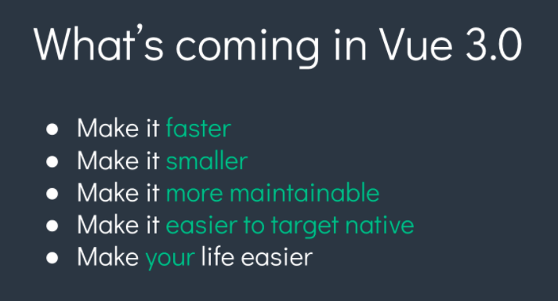

# Vue 3.0 新特性，主讲：汤小洋

## 一、迎接 Vue 3.0

### 1. 简介



​	Vue.js 作者兼核心开发者`尤雨溪`宣布 Vue 3.0 进入 Beta 阶段。

- 已合并所有计划内的 RFC
- 已实现所有被合并的 RFC
- Vue CLI 现在通过 vue-cli-plugin-vue-next 提供了实验性支持

### 2. 新特性

​	重点关注：

- 更快更省

    Object.defineProperty ——> Proxy

    重构 Virtual DOM

- 完全的TypeScript

    团队开发更轻松

    架构更灵活，阅读源码更轻松

    可以独立使用Vue内部模块

- Composition API（组合式API）

    一组低侵入式的、函数式的 API

    更好的逻辑复用与代码组织

    更好的类型推导

### 3. 参考资源

- https://github.com/vuejs/vue-next
- https://vue-composition-api-rfc.netlify.app

## 二、初始化项目

1. 系统环境

    ```bash
    npm -v
    nrm ls
    ```

2. 安装@vue/cli

    ```bash
    npm install @vue/cli -g
    ```

3. 创建项目

    ```bash
    vue create 项目名
    ```

4. 在项目中安装 `vue-next`插件，试用Vue3 beta

    ```bash
    vue add vue-next
    ```

5. 项目变化

    ```js
    import { createApp } from 'vue';
    import App from './App.vue'
    
    createApp(App).mount('#app')
    ```

6. 启动项目

    ```bash
    npm run serve
    ```

​    补充：

1. vue-devtools 暂不支持Vue 3.0
2. VSCode中安装Vue 3 Snippets插件

## 三、setup函数

​	`setup` 函数是一个新的组件选项。作为在组件内使用 Composition API 的入口点。

### 1. 调用时机

​	`setup` 函数会在 `beforeCreatee` 钩子之前被调用

### 2. 返回值

​	如果 `setup` 返回一个对象，则对象的属性可以在组件模板中被访问

### 3. 参数

​	第一个参数为 `props`，接收当前组件props选项的值，即获取父组件传递过来的参数

```js
export default {
  props: {
    name: String,
  },
  setup(props) {
    console.log(props.name)
  },
}
```

​	第二个参数为`context`，接收一个上下文对象，该对象中包含了一些在`vue 2.x` 中需要通过 `this` 才能访问到属性

```js
const MyComponent = {
  setup(props, context) {
    context.attrs
    context.slots
    context.emit
  }
}
```

​	**注：在 `setup()` 函数中无法访问 `this`**

## 四、响应式系统API

​	Vue 3.0提供的一组具有响应式特性的函数式API，都是以函数形式提供的

### 1. reactive

​	`reactive()`函数接收一个普通对象，返回该普通对象的响应式代理对象

​	简单来说，就是用来创建响应式的数据对象，等同于`vue 2.x` 的 `Vue.observable()`函数

​	步骤：

1. 按需导入 `reactive` 函数

    ```js
    import { reactive } from 'vue'
    ```

2. 调用 `reactive` 函数，创建响应式数据对象

    ```js
    setup() {
         // 创建响应式数据对象
        const data = reactive({count: 0})
    
         // 将响应式数据对象暴露出去
        return data;
    }
    ```

### 2. ref

​	`ref()`函数接收一个参数值，返回一个响应式的数据对象。该对象只包含一个指向内部值的 `.value` 属性

- 基本用法
- 在模板中访问时，无需通过.value属性，它会自动展开 
- 在reactive对象中访问时，无需通过.value属性，它会自动展开 

### 3. computed

​	`computed()` 函数用来创建计算属性，函数的返回值是一个 `ref` 的实例

- 只读的计算属性
- 可读可写的计算属性

### 4. readonly

​	`readonly()`函数接收一个对象（普通或响应式），返回一个原始对象的只读代理对象

### 5. watch

​	`watch()` 函数用来监视数据的变化，从而触发特定的操作，等同于 vue 2.x中的 `this.$watch`

- 监视单个数据源
- 监视多个数据源
- 取消监视
- 清除无效的异步任务

### 6. watchEffect

​	`watchEffect()`函数接收一个函数作为参数，并立即执行该函数，同时响应式追踪其依赖，并在其依赖变更时重新运行该函数。

## 五、响应式系统工具集

### 1. isRef

​	检查一个值是否为一个 ref 对象。

### 2. isReactive

​	检查一个对象是否是由 `reactive` 创建的响应式代理。

### 3. isReadonly

​	检查一个对象是否是由 `readonly` 创建的只读代理。

### 4. isProxy

​	检查一个对象是否是由 `reactive` 还是 `readonly` 方法创建的代理。	

### 5.unref

​	如果参数是一个 ref 则返回它的 `value`，否则返回参数本身。它是 `val = isRef(val) ? val.value : val` 的语法糖。

### 6. toRef

​	`toRef()`函数用来将 reactive 对象的一个属性创建为一个 ref，并且这个 ref 具有响应性，可以被传递。

### 7. toRefs

​	`toRefs()`函数用来将 reactive 对象创建为一个普通对象，但该普通对象的每个属性都是一个 ref，并且这个 ref 具有响应性，可以被传递。

## 六、生命周期钩子函数

​	Vue 3.0 中的生命周期函数和 Vue 2.x 相比做了一些调整和变化，对应关系如下：

- `beforeCreate` -> 使用 `setup()`
- `created` -> 使用 `setup()`
- `beforeMount` -> `onBeforeMount`
- `mounted` -> `onMounted`
- `beforeUpdate` -> `onBeforeUpdate`
- `updated` -> `onUpdated`
- `beforeDestroy` -> `onBeforeUnmount`
- `destroyed` -> `onUnmounted`
- `errorCaptured` -> `onErrorCaptured`

​    这些生命周期钩子函数只能在 `setup()` 函数中使用

## 七、依赖注入

​	依赖注入就是祖先组件向后代组件传递数据，使用`provide()` 和 `inject()` 函数来实现，功能类似 vue 2.x中的 `provide/inject`

​	这两个函数只能在 `setup()` 函数中使用：

- 在祖先组件中使用`provide()`函数向下传递数据
- 在后代组件中使用`inject()`函数获取上层传递过来的数据

## 八、模板 Refs

​	通过 `ref()`函数还可以引用页面上的元素或组件，功能类似于 vue 2.x中的 `vm.$refs`

​	步骤：

1. 在 `setup()` 中创建一个 ref 对象并返回它
2. 在页面上为元素添加 ref 属性，并设置属性值与创建的 ref 对象的名称相同
3. 当页面渲染完成后，可以通过该 ref 对象获取到页面中对应的DOM元素


